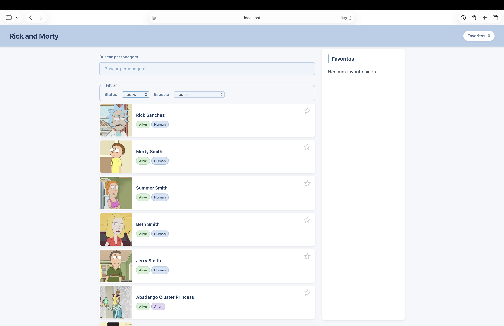
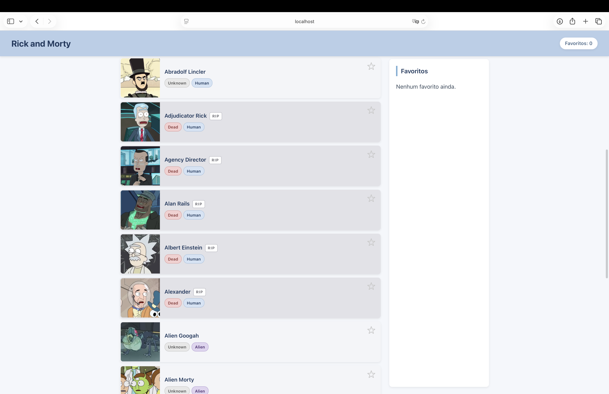
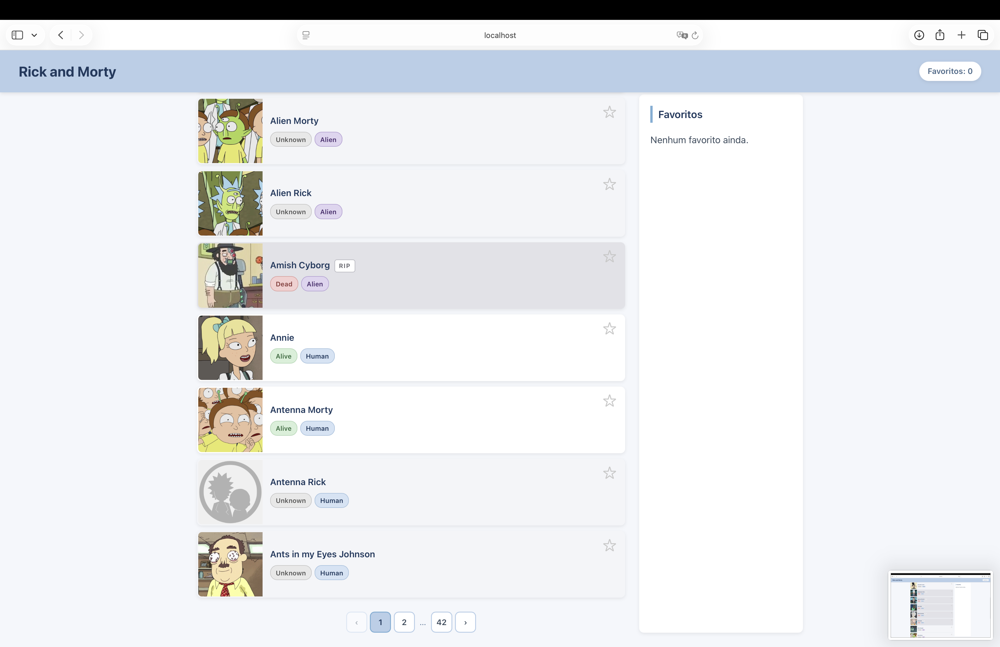
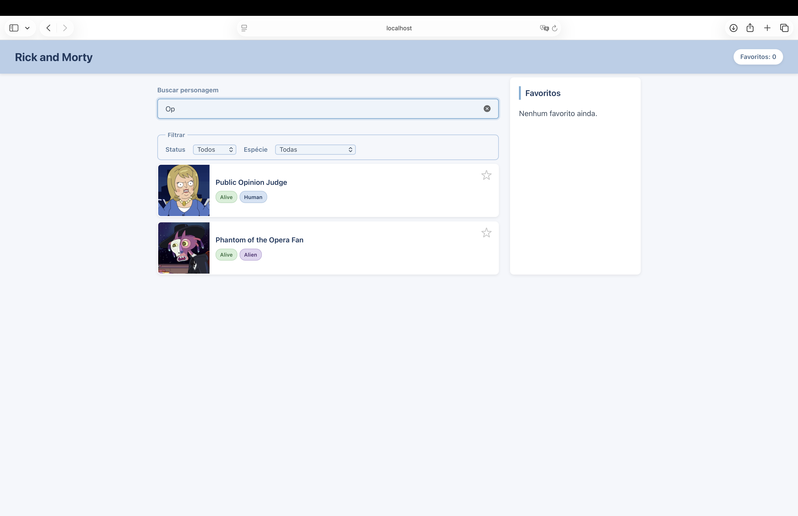
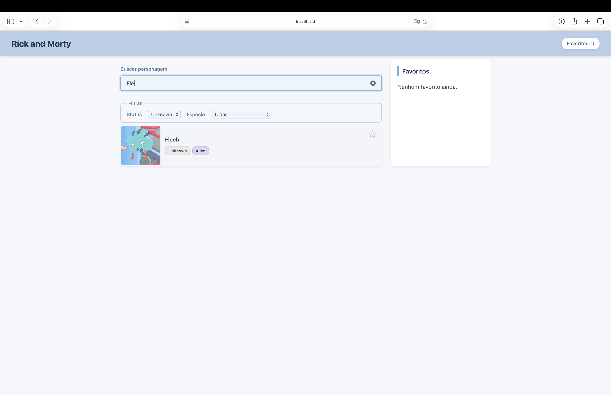
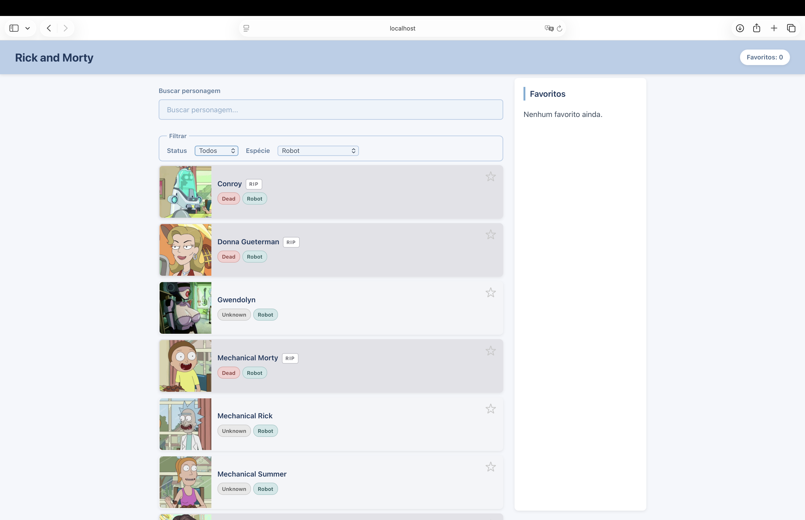
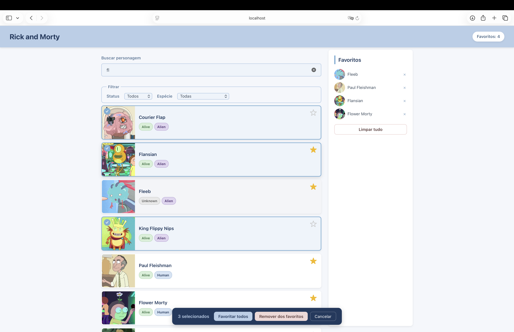
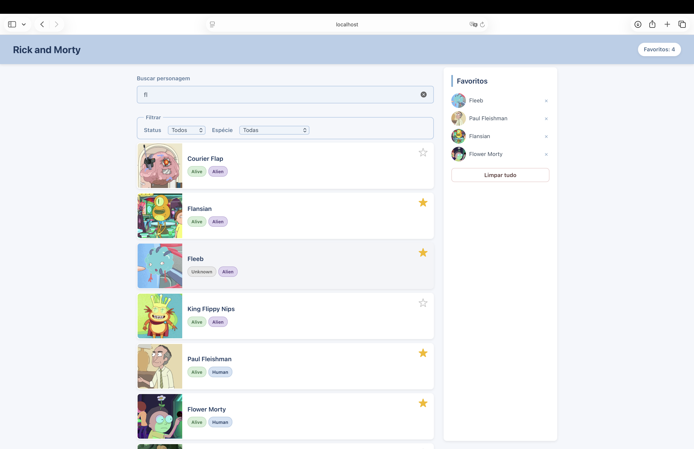

# Explorador de Personagens — Rick Or Morty

Aplicação React que consome a [Rick and Morty API](https://rickandmortyapi.com/) e permite buscar personagens, filtrar por status/espécie, navegar por páginas e montar uma lista de favoritos.

Desafio da Aula 3 do curso de React.

## Funcionalidades

- Lista personagens da API ao carregar a página
- Busca por início do nome ou sobrenome (com debounce de 400ms)
- Filtros por status (Alive / Dead / Unknown) e espécie
- Paginação com números de página
- Adicionar / remover / limpar favoritos
- Seleção múltipla de personagens com ações em lote (favoritar todos, remover dos favoritos)
- Contador de favoritos no cabeçalho fixo
- Tratamento de estados de carregamento e erro
- Não permite favoritar o mesmo personagem duas vezes
- HTML semântico (`header`, `main`, `aside`, `article`, `nav`, `form`, `ul`)

## Screenshots

### Tela inicial




### Busca por nome


### Busca por nome combinada com filtro de status


### Filtro por espécie


### Seleção múltipla


### Lista de favoritos


## Stack

- React
- TypeScript
- Vite
- CSS

## Como rodar

```bash
cd rick-or-morty
npm install
npm run dev
```

## Como acessar

Após rodar `npm run dev`, o terminal vai mostrar algo como:

```
  VITE v5.4.21  ready in 329 ms

  ➜  Local:   http://localhost:5173/
```

Abra **http://localhost:5173** no seu navegador.

> O projeto roda em um servidor de desenvolvimento local (Vite). Ele não pode ser aberto direto pelo arquivo `index.html` no navegador, pois usa módulos ES que precisam ser servidos por HTTP.

Para parar o servidor: `Ctrl + C` no terminal.

## Estrutura

Organizada **por feature**:

```
src/
├── App.tsx                       Raiz e composição da página
├── App.css                       CSS global
├── index.css                     Reset e estilos base
├── main.tsx                      Ponto de entrada
├── favoritos/                    Tudo relacionado à feature de favoritos
│   ├── FavoritosContext.tsx      Provider + reducer + hook useFavoritos
│   ├── ListaFavoritos.tsx        Painel lateral de favoritos
│   └── BarraSeleção.tsx          Barra de seleção múltipla
├── personagens/                  Tudo relacionado à feature de personagens
│   ├── useCharacters.ts          Custom hook: fetch + loading + erro + paginação
│   ├── CardPersonagem.tsx        Card individual (article)
│   ├── ListaPersonagens.tsx      Lista (ul) de cards
│   ├── Busca.tsx                 Campo de busca
│   ├── Filtros.tsx               Selects de status e espécie
│   └── Paginacao.tsx             Navegação numérica entre páginas
└── shared/                       Compartilhado entre features
    ├── Header.tsx                Cabeçalho fixo com contador
    └── types.ts                  Personagem, Estado, Action
```

## Conceitos React aplicados

| Requisito | Onde |
|---|---|
| `useState` | Texto de busca, filtros, página atual, seleção múltipla |
| `useEffect` | `useCharacters.ts` — dispara fetch quando filtros mudam |
| `useReducer` | `FavoritosContext.tsx` — ações ADICIONAR, REMOVER, LIMPAR |
| `useContext` | Hook `useFavoritos` consumido em vários componentes sem prop drilling |
| Custom hook | `useCharacters` isola toda a lógica de consumo da API |

## Decisões técnicas

- **Debounce na busca:** 400ms para evitar uma requisição por keystroke.
- **Filtro por início de palavra:** a API só filtra por "contém"; o filtro por "começa com" é aplicado no front após receber a resposta.
- **Reset de página:** mudar busca ou filtros volta automaticamente para a página 1.
- **Reducer puro:** `ADICIONAR` valida duplicatas dentro do reducer, mantendo a regra centralizada.
- **HTML semântico antes de classes:** o CSS usa seletores de elemento (`article.card-personagem`, `aside.lista-favoritos`) em vez de classes genéricas.

## API

Todos os dados vêm de https://rickandmortyapi.com/api/character

Parâmetros usados: `name`, `status`, `species`, `page`.
